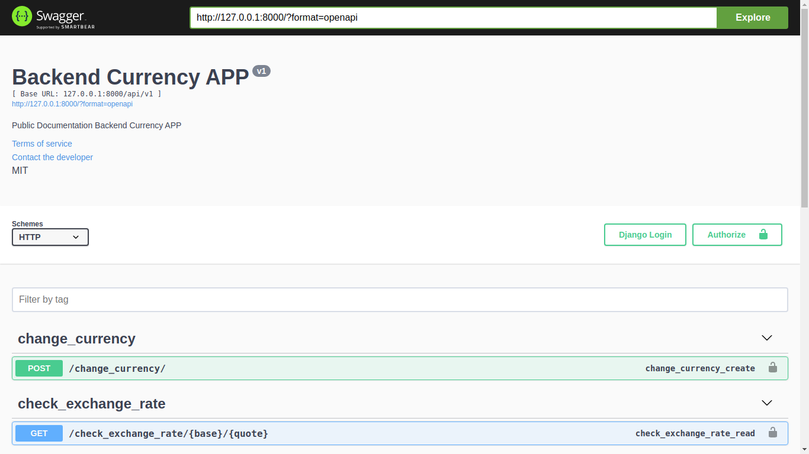
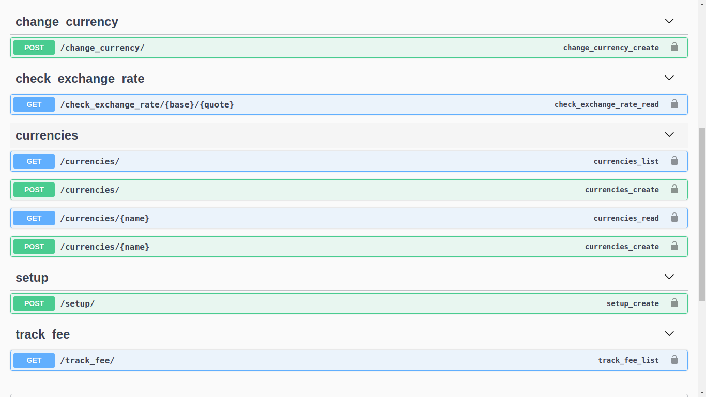
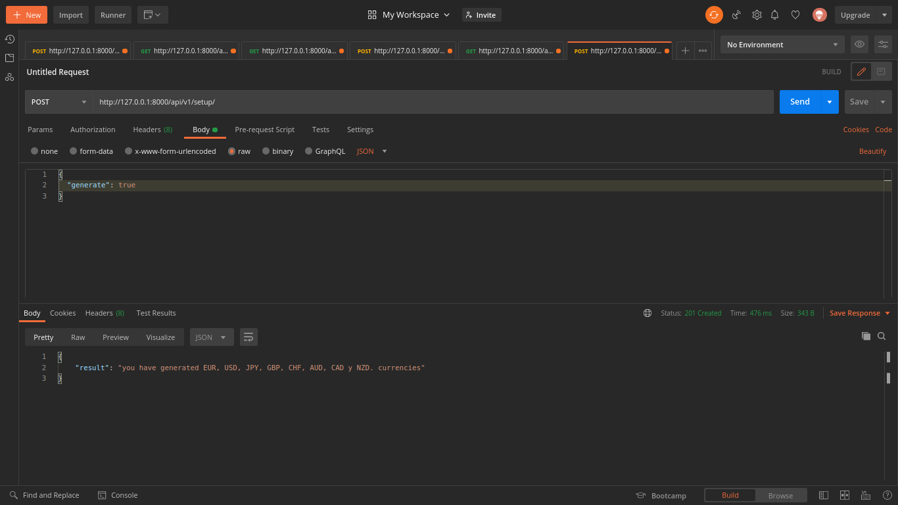
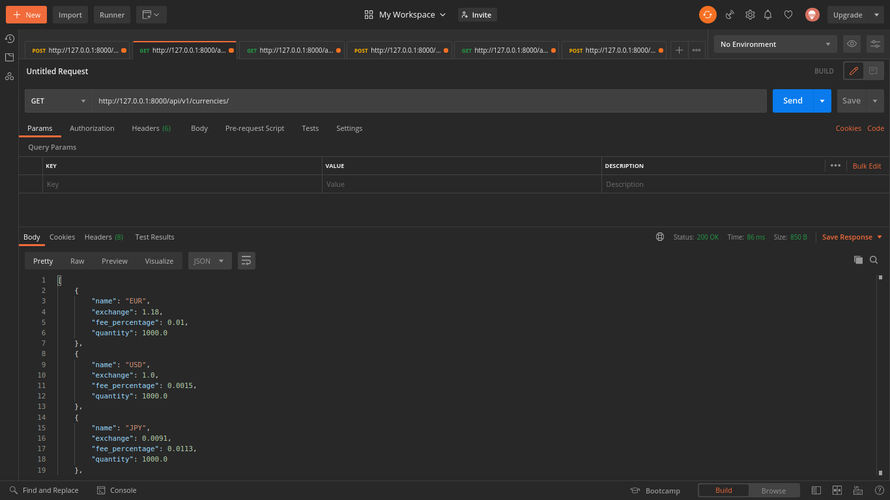
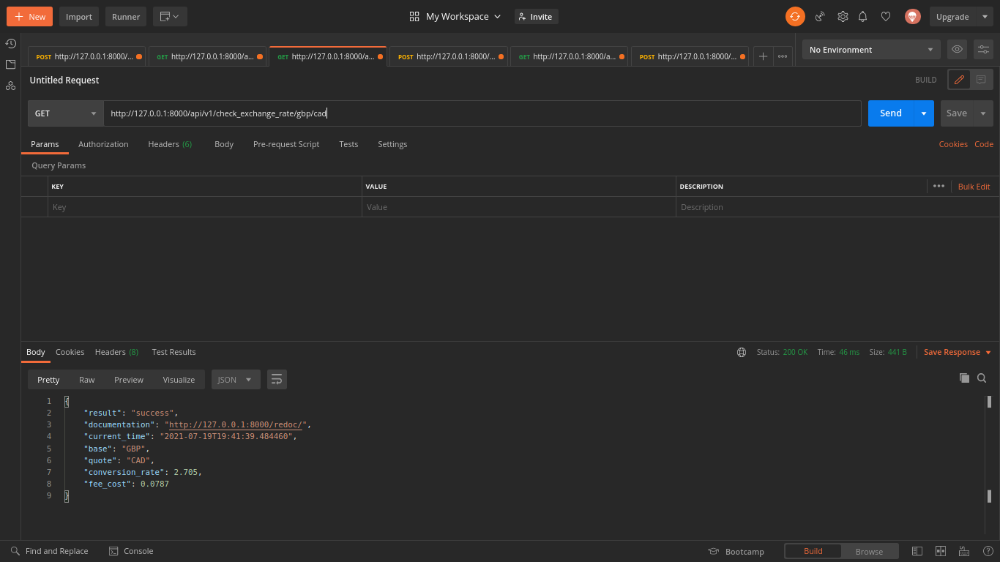
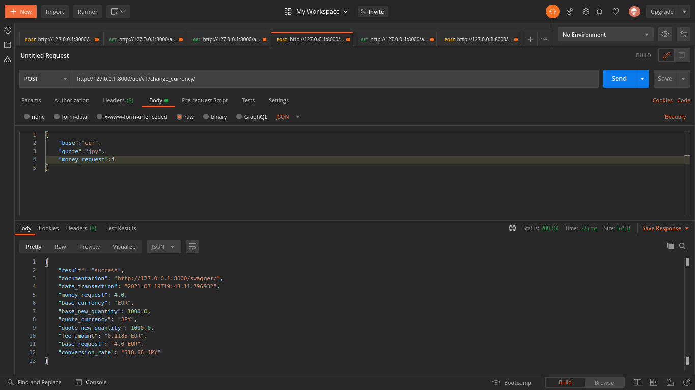
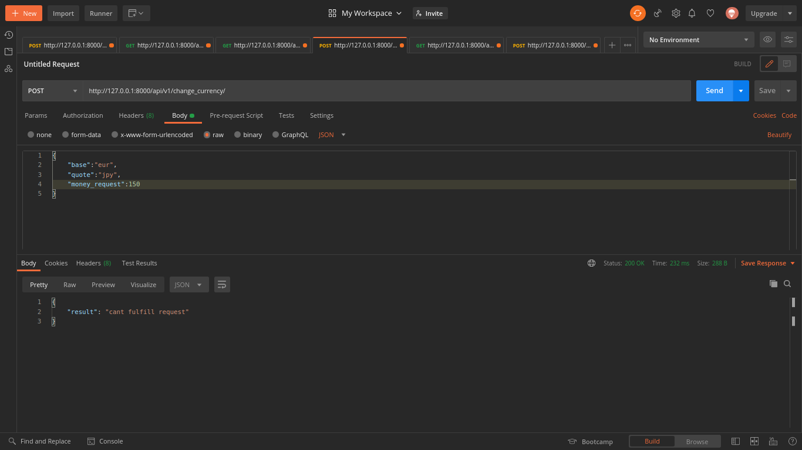
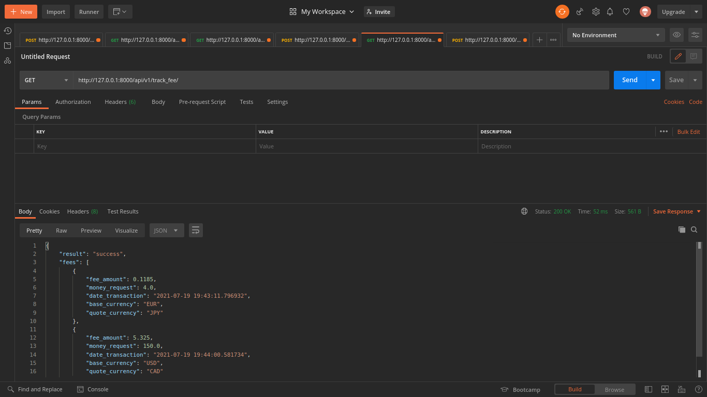
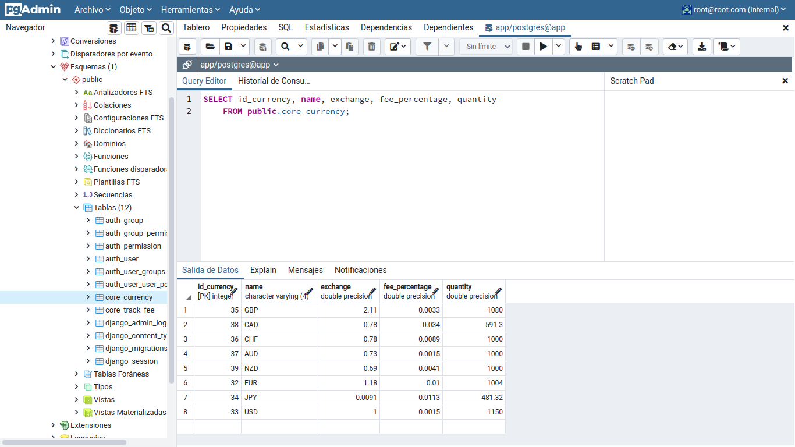
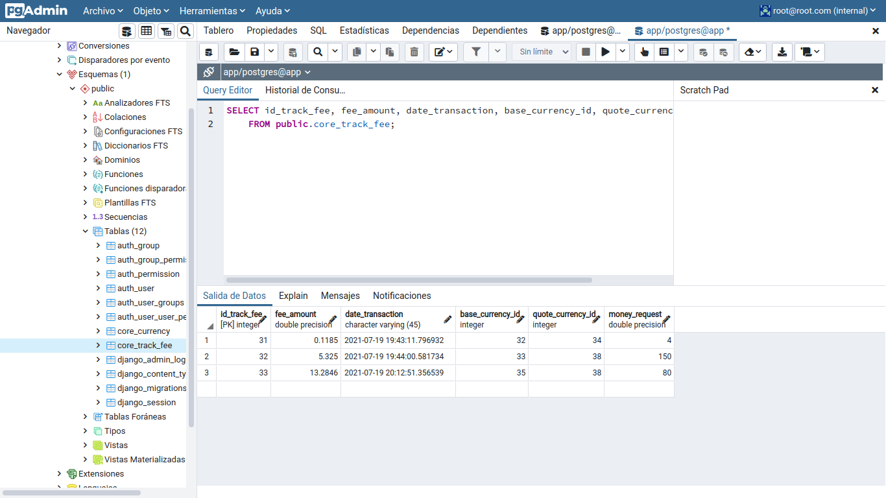

# Currency exchange API.

[](https://travis-ci.org/joemccann/dillinger)

 ## Inicio 🚀 
Currency exchange API. Es una RESTful API que tiene como principales funcionalidades: consultar tipos de cambio y cambiar una divisa. fue creada en el ecosistema de Python:


## Tech

Currency exchange API usa varias tecnologías open source para que el proyecto funcione correctamente:

- [Python3]
- [Django3]
- [Django rest framework]
- [Postgresql]
- [Docker]
- [Git]
- [drf-yasg]

## Pre requisitos

Currency exchange API requiere que tengas instalado Python3 y Composer.


## Desarrolladores

¿Quieres contribuir o probar? Genial!

Abre tu terminal favorita y escribe estos comandos.

Clona:

```sh
git clone https://github.com/jblanquicett92/currency_app.git
```

o descarga y descomprime


Primer Tab:

```sh
docker-compose build
```

Segundo Tab
```sh
docker-compose up
```

## Documentación

Cuando el software ya se encuentre desplegado podrás ver la documentación swagger

```sh
http://127.0.0.1:8000/swagger/
```



## Endpoints

Sigue las instrucciones atentamente para poder consumir los servicios de los endpoints 

## Setup

```sh
POST: http://127.0.0.1:8000/api/v1/setup/
```

```sh
{
  "generate": false
}
```
- POST: Cambiar valor a true para crear monedas automáticamente, 
- ATENCIÓN: No mandar dos veces el request, porque se van a crear monedas duplicadas 

## Currencies
```sh
http://127.0.0.1:8000/api/v1/currencies/{id}
```

- GET: Recibimos del endpoint un listado JSON con objetos tipo Currency 
- GET: Consultamos al endpoint un objeto JSON tipo Currency   
- POST: Enviamos al endpoint un request con el body en formato JSON
```sh
 {
    "name": "COP",
    "exchange": 0.00023,
    "fee_percentage": 1.002,
    "quantity": 1000
}
```

## Check exchange rate
```sh
http://127.0.0.1:8000/api/v1/check_exchange_rate/{base}/{quote}
```

- GET: Recibimos del endpoint un objeto tipo JSON con información de la consulta del tipo de cambio
```sh
 {
    "result": "success",
    "documentation": "http://127.0.0.1:8000/swagger/",
    "current_time": "2021-07-20T07:50:29.404788",
    "base": "CAD",
    "quote": "EUR",
    "conversion_rate": 0.661,
    "fee_cost": 0.0343
}
```

## Change_currency
```sh
http://127.0.0.1:8000/api/v1/change_currency/
```


- POST: Enviamos al endpoint un request con el body en formato JSON, con la siguiente estructura 
```sh 
   {
    "base":"cad",
    "quote":"gbp",
    "money_request":3
  }
```
- RESPONSE: El endpoint en caso de que la moneda de cotización tenga capacidad de ser cambiada respondera asi:
```sh
 {
    "result": "success",
    "documentation": "http://127.0.0.1:8000/swagger/",
    "date_transaction": "2021-07-20T07:53:51.287029",
    "money_request": 3.0,
    "base_currency": "CAD",
    "base_new_quantity": 574.582,
    "quote_currency": "GBP",
    "quote_new_quantity": 1023.958,
    "fee_amount": "0.0681 CAD",
    "base_request": "3.0 CAD",
    "conversion_rate": "1.10 GBP"
}
```
- Ó

```sh
{
    "result": "cant fulfill request"
}
```

## track_fee
```sh
http://127.0.0.1:8000/api/v1/track_fee/
```


- GET: Recibimos del endpoint listado tipo JSON con información de todas las transacciones de cambios de divisas 
```sh 
   "result": "success",
    "fees": [
        {
            "fee_amount": 0.1185,
            "money_request": 4.0,
            "date_transaction": "2021-07-19 19:43:11.796932",
            "base_currency": "EUR",
            "quote_currency": "JPY"
        }
```


## Uso de PG4 WEB
Podras gestionar la base de datos con la siguiente url:
```sh
http://127.0.0.1:8889/
```



las credenciales son
```sh
root@root.com
root
```

MIT